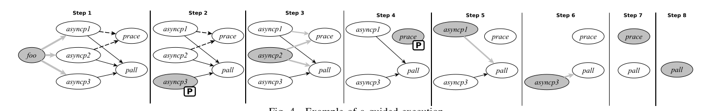

# NodeRacer: Event Racer Detection

## Navegação

1. [Introdução](#introducao)
2. [Motivação](#motivacao)
3. [Background](#background)
4. [Abordagem](#abordagem)

## <a name="introducao"></a>1. Introdução

JavaScript é uma linguagem de programação dinâmica multiparadigma (permitir que o programador implemente o código através do uso dos mais adequados paradigmas ao problema em questão) que foi inicialmente projetada para programar aplicações web do lado do cliente.
Entretanto viu-se uma necessidade de executar aplicações do lado so servidor e como consequencia, em 2009, foi lançado a plataforma Node.js que ajudou a espalhar o Javascript para outros domínios, incluindo aplicativos de servidor, ferramentas de linha de comando e até mesmo aplicativos de desktop.

## <a name="motivacao"></a>2. Motivação

---

## <a name="background"></a>3. Background

A arquitetura do Node.js é baseada em eventos onde `callbacks` (também conhecidos como manipuladores de eventos) são registrados para serem executados quando eventos relevantes ocorrem. Os `callbacks` são agendados para serem executados por um loop de eventos single-threaded. Dessa forma, podemos descrever o nodeJs através de evento e single-thread, o que significa que todas as operações que demandam tempo de execução (como operações de entrada e saída, I/O) são executadas de maneira assíncrona. Isso funciona da seguinte forma: uma função é chamada e associada a um callback. Por exemplo, ao ler dados de um arquivo, a execução principal não é interrompida; em vez disso, o Node.js continua executando outras tarefas e chama o callback quando a leitura do arquivo é concluída.

`Single-threaded` refere-se a um ambiente de execução onde apenas uma thread está ativa e executando tarefas de cada vez. Em um sistema single-threaded, todas as tarefas são processadas sequencialmente pela única thread disponível. Isso significa que, enquanto uma tarefa está sendo executada, nenhuma outra tarefa pode ser iniciada até que a primeira seja concluída.

No Node.js, quando se executa operações assíncronas como leitura de arquivos, solicitações HTTP ou outras operações de entrada/saída (I/O), essas operações são tratadas em segundo plano para que o programa não fique parado esperando a operação ser concluída. Isso é crucial para que o Node.js seja eficiente em lidar com muitas conexões simultâneas sem bloquear a thread principal.

Para lidar com essas operações assíncronas, o Node.js possui um mecanismo interno de `thread pool`. Este pool de threads é um conjunto de threads separadas, independentes da thread principal do Node.js, que são usadas para executar essas operações de I/O assíncronas em paralelo.

Por exemplo, se ocorrecem várias solicitações de leitura de arquivos simultaneamente em um código Node.js, o Node.js pode atribuir cada uma dessas operações de leitura de arquivo a uma thread diferente no pool de threads. Isso permite que várias operações de leitura de arquivo ocorram em paralelo, enquanto a thread principal do Node.js continua a executar outras tarefas.

Portanto, o pool de threads do Node.js é usado para executar operações de I/O assíncronas em segundo plano, enquanto a thread principal do Node.js continua a executar outras tarefas e a lidar com o loop de eventos. Isso ajuda o Node.js a ser eficiente e escalável em ambientes com muitas solicitações concorrentes.

Alem disso cada thread em um pool de threads tem seu próprio espaço de memória separado. Isso significa que as variáveis e os recursos alocados em uma thread não são compartilhados com outras threads no pool.

Por exemplo, se está sendo realizado várias operações de leitura de arquivos em paralelo em diferentes threads do pool, cada thread tem sua própria área de memória para armazenar os dados lidos do arquivo e para realizar qualquer processamento adicional necessário. Isso garante que os dados e recursos em uma thread não interfiram ou sejam afetados pelas operações em outras threads.

Essa separação de memória entre as threads é fundamental para garantir a integridade e a segurança dos dados, bem como para evitar condições de corrida e outros problemas de concorrência que podem ocorrer em sistemas multithreaded se não forem tratados corretamente.

Quando uma operação de I/O é concluída, o resultado é enviado de volta para a thread principal do Node.js. O callback associado à operação é então colocado na fila do loop de eventos para ser executado quando a thread principal estiver livre para processá-lo. Entretanto, a ordem em que os `callbacks` são chamados é não determinística, ou seja, não podemos prever com certeza em qual ordem os `callbacks` serão executados. Isso ocorre especialmente em um ambiente assíncrono e concorrente, onde várias operações podem ocorrer simultaneamente e seus `callbacks` podem ser chamados em momentos diferentes.

Além disso, quando múltiplas operações assíncronas estão ocorrendo simultaneamente e seus `callbacks` são chamados em momentos diferentes, seus períodos de execução podem se sobrepor no tempo. Esse fenômeno é chamado de interleaving.

Devido a essas características, aplicações Node.js são suscetíveis a `condições de corrida (event races)`, que podem causar bugs de corrida (race bugs). Esses bugs são difíceis de detectar e podem levar a crashes, travamentos do sistema e persistência de dados inconsistentes.

## <a name="abordagem"></a>4. abordagem

A abordagem `NODERACER` é composta por três fases principais.

- Fase 1: Instrumentação e Coleta de Informações

Na primeira fase, o NODERACER instrumenta a aplicação para monitorar seu comportamento assíncrono. Isso envolve modificar o código da aplicação para registrar eventos importantes, como a criação e execução de callbacks. Durante uma execução da aplicação — que pode ser conduzida por um teste automatizado ou por uma interação manual — o NODERACER coleta informações detalhadas sobre quando e como os callbacks são registrados e executados. Essas informações são armazenadas em um arquivo de log para uso posterior.

- Fase 2: Identificação da Relação Happens-Before

Na segunda fase, o NODERACER analisa os logs coletados para determinar uma relação de precedência ("happens-before") entre os callbacks. Essa relação é fundamental para entender a ordem causal dos eventos assíncronos na aplicação. O NODERACER aplica várias regras para inferir essa ordem, como garantir que um callback registrado durante a execução de outro deva ser executado posteriormente. Essas regras ajudam a modelar a lógica assíncrona da aplicação com precisão, identificando dependências causais entre os callbacks.

- Fase 3: Execução Controlada e Detecção de Erros

Na terceira fase, o NODERACER executa a aplicação repetidamente em um modo especial que adia seletivamente os callbacks. Durante essas execuções, o NODERACER manipula a ordem de execução dos callbacks, respeitando a relação de precedência identificada na Fase 2, para tentar expor erros de corrida de eventos. Adiando certos callbacks e permitindo que outros sejam executados antes, o NODERACER pode revelar condições de corrida que não seriam evidentes em uma execução normal, ajudando a identificar e corrigir bugs que poderiam causar falhas ou comportamento inesperado na aplicação.

### Fase de observação

Na fase de observação, o `NODERACER` instrumenta o código da aplicação para rastrear _comportamentos assíncronos_, _chamadas de funções_ e _certas funções nativas_. Em seguida, ele executa a aplicação e coleta informações sobre a execução em um arquivo de `log`.

Primeiro, o `NODERACER` rastreia a vida útil do comportamento assíncrono usando as funções `Async Hooks`: `init`, `before` e `promiseResolve`.

A função `init` é chamada toda vez que um `callback assíncrono` é registrado, e o `NODERACER` adiciona uma entrada no log com um ID de callback único, o ID do callback em execução e o tipo de callback (Immediate, Timeout, TickObject, Promise ou Outro). Para timeouts, ele também registra o atraso especificado no registro.

A função `before` é chamada imediatamente antes da execução de um callback, e, nesse caso, uma entrada é adicionada ao log com o ID do callback. Essas entradas são usadas principalmente para distinguir diferentes ocorrências de um callback; por exemplo, setInterval define um callback que pode ser chamado várias vezes.

A função `promiseResolve` é chamada quando uma promise é resolvida, e, nesse caso, uma entrada é adicionada ao log com o ID do callback e o ID do callback em execução, permitindo a identificação da causalidade entre promises.

A `API Async Hooks` não fornece diretamente informações sobre quais funções são usadas como callbacks. Por essa razão, também usamos a biblioteca `njsTrace`, que fornece duas funções de hook, `onEntry` e `onExit`, permitindo ao `NODERACER` adicionar uma entrada cada vez que uma função é chamada ou retornada, respectivamente, com informações sobre a função (seu nome, se disponível, caminho do arquivo e número da linha) e o ID do callback em execução.

Finalmente, fazemos uma modificação ou extensão (monkey patch) nas funções `Promise.all` e` Promise.race` para rastrear de maneira semelhante quando são chamadas ou retornadas (com entradas init do Async Hooks no meio).

Todas as informações registradas são usadas na próxima fase para identificar os callbacks e as restrições de ordenação entre eles.

### Regras de Identificação de Precedência ("Happens-Before")

Na segunda fase, o NODERACER identifica uma relação de acontecimento antes (happens-before) para os retornos de chamada observados na fase anterior. Cada retorno de chamada corresponde a uma iteração do ciclo de eventos. Intuitivamente, um retorno de chamada `ei` acontece antes de outro retorno de chamada `ej`, denotado como `ei` < `ej`, se `ej` depender causalmente de `ei`. Para modelar o Promise.race, também usamos uma variante de acontecimento antes, escrita como `{ei1, ..., eik}` << `ej`, o que significa que `ej` pode ser executado após pelo menos um dos `ei1, ..., eik` ter sido executado.

Para identificar a relação de acontecimento antes, o NODERACER examina as entradas do arquivo de log e aplica nove regras. As Regras 1 a 4 são retiradas da literatura e revisitam o conhecimento existente sobre operações assíncronas no Node.js. Nós estendemos essas com as Regras 5 a 9 para trazer uma modelagem mais precisa de algumas operações do Node.js`

#### Regra #1:

Um callback precisa ser registrado antes de poder ser executado. Se um callback `ej` for registrado durante a execução de outro callback `ei`, então `ei` precede `ej`.

- **Exemplo**: O callback de leitura é registrado durante a execução do callback de estatísticas. Portanto, o callback de estatísticas precede o callback de leitura.

#### Regra #2:

Esta regra modela o caso em que uma promessa (promise) é resolvida. Um callback `ei` que resolve uma promessa `p` precisa ser executado antes do callback `ej` associado à promessa `p`. Ou seja, `ei` precede `ej`.

#### Regra #3:

Os callbacks podem ter diferentes tipos, dependendo de como foram registrados. Utilizamos a função "type" para denotar o tipo de callback, onde `I` representa Immediate, `N` representa nextTick, `T` representa Timeout, `P` representa Promises e `O` representa Other.

- **FIFO**: Callbacks dos tipos Immediate, nextTick e Promises são sempre agendados seguindo uma disciplina FIFO (First In, First Out). Portanto, se `ei` for registrado antes de `ej` no mesmo tick e tiver o mesmo tipo, então `ei` precede `ej`.

#### Regra #4:

Para callbacks dos tipos Immediate, nextTick e Promises, podemos estabelecer relações entre callbacks registrados em ticks diferentes. Suponha que `ei` e `ej` tenham o mesmo tipo e foram registrados ou resolvidos em callbacks diferentes. Se o callback que registrou `ei` precede o callback que registrou `ej`, então `ei` precede `ej`.

#### Regra #5:

Callbacks de Timeout também operam seguindo uma disciplina FIFO, mas seus delays precisam ser levados em conta. Usamos `e.t` para referir-se ao timeout específico do callback. Se `ei` for registrado antes de `ej`, ambos com tipo Timeout e `ei.t` menor ou igual a `ej.t`, então `ei` precede `ej`. Se `ei` e `ej` forem registrados no mesmo tick, normalmente, o com o menor timeout será executado primeiro. No entanto, pode haver um longo delay até que seja agendado para execução, caso em que o outro callback também será habilitado. Portanto, se `ei` for registrado antes de `ej` (possivelmente no mesmo tick) mas `ei.t` for maior que `ej.t`, não existem restrições de ordenação entre os dois callbacks.

#### Regra #6:

A função setInterval provoca várias instâncias de callbacks `e1, e2, ..., en`. Como os callbacks são executados um após o outro, temos que cada callback precede o próximo.

#### Regra #7:

Suponha que promessas `p1, p2, ..., pn` sejam resolvidas por callbacks `e1, e2, ..., en` e que `p1, p2, ..., pn` sejam passadas como argumento para Promise.all, e deixe `e_all` ser seu callback resultante. Neste caso, `e_all` será chamado apenas após `e1, e2, ..., en`, então cada callback que resolve uma promessa precede o callback resultante do Promise.all.

#### Regra #8:

Suponha que promessas `p1, p2, ..., pn` sejam resolvidas por callbacks `e1, e2, ..., en` e que `p1, p2, ..., pn` sejam passadas como argumento para Promise.race, e deixe `erace` ser seu callback resultante. Não podemos exigir que cada callback que resolve uma promessa preceda o callback resultante do Promise.race, pois apenas uma delas precisa ser verdadeira em uma execução. Portanto, representamos isso como um grupo de callbacks que precede o callback resultante do Promise.race.

#### Regra #9:

A alta prioridade dos callbacks TickObject nos permite relacioná-los a outros tipos de callbacks. Suponha que `ei` seja um callback TickObject registrado em um callback pai e `ej` seja um callback de outro tipo. Se o callback pai que registrou `ei` precede `ej`, então `ei` precede `ej`.

Além dessas nove regras, a precedência é transitiva: se `e1` precede `e2` e `e2` precede `e3`, então `e1` precede `e3`.

Código 1:

```javascript
function foo() {
  let p1 = new Promise((resolve, reject) => {
    function asyncp1() {
      resolve();
    } //run async
  });

  let p2 = new Promise((resolve, reject) => {
    function asyncp2() {
      resolve();
    } //run async
  });

  let p3 = new Promise((resolve, reject) => {
    function asyncp3() {
      resolve();
    } //run async
  });

  Promise.all([p1, p2, p3]).then(function pall(values) {});

  Promise.race([p1, p2]).then(function prace(value) {});
}
```

O código 1 envolve seis callbacks: foo (linha 23), asyncp1 (linha 25), asyncp2 (linha 28), asyncp3 (linha 31), pall (linha 33) e prace (linha 34). O callback pall será executado apenas após os callbacks asyncp1, asyncp2 e asyncp3 resolverem as promessas p1, p2 e p3, respectivamente.

Então, podemos inferir pela Regra #7 que:

- asyncp1 precede pall
- asyncp2 precede pall
- asyncp3 precede pall.

O callback `prace` dependerá de qual promessa é resolvida primeiro, p1 ou p2, então asyncp1 ou asyncp2 podem acontecer antes de `prace`. Usando a representação da Regra #8, temos {asyncp1, asyncp2} precedem fortemente prace`

A relação de precedência resultante pode ser representada como um grafo, que chamamos de hb-grafo (grafo de happens-before). A Figura 3 mostra o hb-grafo para o código da Figura 2. O hb-grafo é um grafo direcionado com um nó para cada callback e arestas direcionadas representando a relação de precedência. `Linhas sólidas` e l`inhas tracejadas` representam `precede` e `precede fortemente`, respectivamente.

O grau de entrada de um nó e, escrito como _indegree(e)_, é o número de arestas que entram em e. Omitimos as arestas que são implicadas pela transitividade.

### C. Guided Execution Phase

Na terceira fase, o NODERACER instrumenta as funções de callback e utiliza a relação de precedência ("happens-before") para guiar novas execuções em direção a diferentes interleavings de callbacks, adiando seletivamente os callbacks. Ao considerar a relação de precedência ao selecionar quais callbacks adiar, evita-se interleavings inviáveis em execuções reais, evitando assim alarmes falsos. Além disso, as informações de precedência podem reduzir a sobrecarga de adiamento desnecessário de callbacks. A avaliação na Seção VI mostra a importância dessa utilização das informações de precedência em comparação com uma exploração aleatória mais ingênua.

O Algoritmo 1 captura a essência da instrumentação que o NODERACER realiza para funções de callback. A execução guiada é implementada pelas funções `shouldPostpone` (linha 38) e `notify` (linhas 41 e 45). Quando uma função instrumentada é chamada, o NODERACER coleta informações sobre a função obtidas dos Async Hooks (linha 37) e as passa para `shouldPostpone` para decidir o próximo passo. Se for decidido adiar (linha 39), o NODERACER configura para que o callback seja executado em uma iteração futura do loop de eventos (linhas 40–43) e lembra disso para que seja adiado apenas uma vez. Caso contrário, ele é executado imediatamente (linhas 45–46). Quando o callback é realmente executado, a função `notify` é invocada.

#### Algoritmo 1: Instrumentação de uma função de callback

```plaintext
Function <FUNCTIONNAME>(<PARAMETERS>)
    f ← noderacer.getCurrentFunctionInfo()
    {postpone, ei} ← noderacer.shouldPostpone(f)
    if postpone then
        noderacer.postpone( () => {
            noderacer.notify(f, ei)
            <RUN ORIGINAL FUNCTION CODE>
        } )
    else
        noderacer.notify(f, ei)
        <RUN ORIGINAL FUNCTION CODE>
    end
```

### Funções `shouldPostpone` e `notify`

As funções `shouldPostpone` e `notify` assumem a existência do objeto `hbgraph` que representa uma estrutura de dados como na Figura 3, obtida na fase anterior. Esse objeto é atualizado toda vez que um callback é executado, caso em que o nó que representa o callback e suas arestas de saída são removidos do grafo.

#### Algoritmo 2: Função `shouldPostpone`

```plaintext
Function shouldPostpone(f)
    postpone ← false
    if f.isCallback then
        ei ← hbgraph.find(f)
        if ei != null then
            if hbgraph.mayHappen(ei) then
                if hbgraph.mayPostpone(ei) then
                    postpone ← randomBoolean()
                end
            else
                postpone ← trueck no hb-graph:
            end
        end
    end
    return {postpone, ei}
```

##### Explicação do Algoritmo `shouldPostpone`:

1. **Inicialização**:

   - A variável `postpone` é inicialmente definida como `false`.

2. **Verificação se é Callback**:

   - Se `f` for um callback (`f.isCallback`), o algoritmo prossegue.

3. **Buscar o Callback no hb-graph**:

   - O algoritmo encontra o nó associado ao callback `f` no hb-graph, atribuindo-o a `ei`.

4. **Verificação se o Callback Pode Ocorre**:

   - Se `ei` não for `null`, verifica-se se `ei` pode ocorrer sem violar a relação de precedência (`hbgraph.mayHappen(ei)`).

5. **Decisão de Adiamento**:

   - Se `ei` pode ocorrer, o algoritmo verifica se `ei` pode ser adiado (`hbgraph.mayPostpone(ei)`). Se sim, decide aleatoriamente se vai adiá-lo (`postpone ← randomBoolean()`).
   - Se `ei` não pode ocorrer, o algoritmo define `postpone` como `true`.

6. **Retorno**:
   - A função retorna um par `{postpone, ei}`.

#### Algoritmo 3: Função `notify`

```plaintext
Function notify(f, ei)
    if f.isCallback and ei != null then
        if hbgraph.mayHappen(ei) then
            hbgraph.remove(ei)
        else
            noderacer.unexpectedOrder(ei)
        end
    end
end
```

##### Explicação do Algoritmo `notify`:

1. **Verificação se é Callback e se `ei` não é null**:

   - Se `f` for um callback (`f.isCallback`) e `ei` não for `null`, o algoritmo prossegue.

2. **Verificação se o Callback Pode Ocorre**:
   - Se `ei` pode ocorrer sem violar a relação de precedência (`hbgraph.mayHappen(ei)`), o callback `ei` é removido do hb-graph (`hbgraph.remove(ei)`).
   - Caso contrário, o callback `ei` é registrado como uma ordem inesperada (`noderacer.unexpectedOrder(ei)`).

### Exemplo de Execução Guiada



A Figura 4 ilustra a execução guiada para o exemplo do código 1. O callback atualmente agendado pelo Node.js é representado como um nó cinza. Em cada passo, o NODERACER decide se adia ou executa os callbacks de acordo com a relação de precedência:

1. **Passo 1**:

   - `foo` é chamado e executado, sendo o único que pode ocorrer. Seu nó e arestas de saída são removidos.

2. **Passo 2**:

   - Uma tarefa assíncrona termina e seu callback `asyncp3` é agendado. Como `asyncp3` pode intercalar com outros callbacks (`asyncp1` e `asyncp2`), o NODERACER decide aleatoriamente adiá-lo ou não. Aqui, `asyncp3` é adiado (representado como uma caixa marcada com "P").

3. **Passo 3**:

   - `asyncp2` é agendado e o NODERACER decide não adiá-lo. Ele é então executado e removido do grafo. As arestas (`asyncp2`, `prace`) e (`asyncp1`, `prace`) são removidas junto com o nó.

4. **Passo 4**:

   - `prace` é agendado para execução, mas o NODERACER decide adiá-lo.

5. **Passo 5**:

   - `asyncp1` é executado.

6. **Passo 6**:

   - `asyncp3`, que havia sido adiado, é agora executado.

7. **Passo 7**:

   - `prace` é executado.

8. **Passo 8**:
   - `pall` é executado.

Outras execuções terão diferentes decisões nos passos 2–5 e, como consequência, diferentes interleavings de callbacks serão explorados. Devido aos adiamentos inseridos pelo NODERACER, obtemos uma variedade de interleavings de callbacks que são improváveis de ocorrer em testes ordinários, mas podem aparecer em produção.

## <a name="implementação"></a>1. implementação

A implementação do NODERACER é feita como uma aplicação Node.js com um módulo principal de cerca de 1600 linhas de código. Ele possui uma interface de linha de comando na qual as três fases podem ser executadas separadamente. Como mencionado na Seção IV-A, a fase de observação usa a API Async Hooks e a biblioteca njsTrace. Uma versão modificada do njsTrace também é usada para a fase de execução guiada. O NODERACER inclui algumas funcionalidades para suportar o diagnóstico e a depuração de problemas de corrida. As facilidades de relatório incluem arquivos de rastreamento gerados para cada execução nas fases de observação e execução guiada, bem como imagens para gráficos de acontecimento antes (hb-graphs). Além disso, o NODERACER pode ser executado em um modo de diagnóstico no qual ele sistematicamente adia apenas um retorno de chamada por execução, usando o histórico de execuções anteriores para garantir que um retorno de chamada diferente seja adiado em cada execução. Sempre que um bug puder ser reproduzido nesse modo, destacamos esse único retorno de chamada no hb-graph como definitivamente relacionado ao bug.

## <a name="Evaluation"></a>6. Evaluation

Formulamos as seguintes questões de pesquisa:

- RQ1: Como o NODERACER se compara ao fuzzer de última geração Node.fz?
- RQ2: O uso de relações de acontecimento antes previne execuções inviáveis e evita atrasos desnecessários?
- RQ3: O NODERACER pode ajudar a diagnosticar problemas abertos relacionados a corridas em aplicações Node.js?
- RQ4: O NODERACER pode detectar bugs de corrida ou testes instáveis previamente desconhecidos usando suítes de testes existentes?
